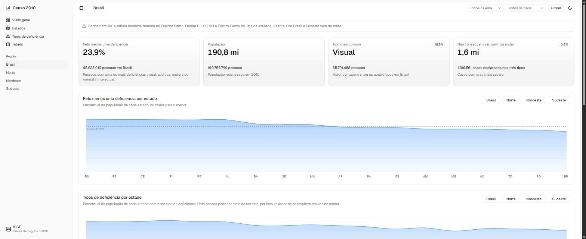

# Censo 2010: Pessoas com deficiência no Brasil

Painel interativo com os dados do Censo Demográfico 2010 do IBGE sobre pessoas com deficiência no Brasil, organizados por região, estado, tipo de deficiência e grau de severidade.



<!-- ajuste depois do primeiro deploy -->
**Ver online:** [https://censo-2010-deficiencia.vercel.app](https://censo-2010-deficiencia.vercel.app)

## O que o painel mostra

- Cards com os principais indicadores.
- Gráfico de área com o percentual de cada estado, do maior para o menor.
- Gráfico de áreas sobrepostas com os quatro tipos de deficiência por estado.
- Tabela ordenável com 18 dos 27 estados.
- Filtros por região, estado e tipo de deficiência.
- Tema claro e escuro.

## Dados

A fonte é o IBGE, Censo Demográfico 2010, tabela "População residente por tipo de deficiência, segundo as Grandes Regiões e as Unidades da Federação".

A versão 0.0.1 traz um conjunto de dados estático e parcial: aparecem 18 dos 27 estados. RJ, SP, PR, SC, RS, MS, MT, GO e DF estão ausentes porque a tabela de origem foi recebida já cortada, sem essas linhas.

Os dados são de um único censo, o de 2010: não há série temporal nem evolução ao longo do tempo.

A leitura pela API pública do IBGE (SIDRA) está planejada para a versão 0.0.2. A variável de ambiente `VITE_DATA_SOURCE=sidra` já existe (veja `.env.example`), mas hoje ainda não busca nada: o painel volta para os dados estáticos e mostra um aviso na tela.

Veja a descrição completa das colunas em [docs/DATA.md](docs/DATA.md).

## Como rodar

```bash
npm install
npm run dev
npm run build
npm run lint
```

## Tecnologias

- Vite
- React 19
- TypeScript
- Tailwind CSS v4
- shadcn/ui
- Recharts
- lucide-react

## Como contribuir

Toda contribuição é bem-vinda. Veja o guia completo em [CONTRIBUTING.md](CONTRIBUTING.md).

Boas primeiras tarefas:

- Completar os estados que faltam no conjunto de dados.
- Integrar a API pública do IBGE (SIDRA).
- Escrever testes.
- Melhorar acessibilidade.
- Traduzir a interface.

## Roadmap

- **0.0.1**: painel com dados estáticos.
- **0.0.2**: dados via API pública do IBGE.
- **0.1.0**: comparação entre censos.

## Licença

Distribuído sob a licença MIT. Veja [LICENSE](LICENSE).
